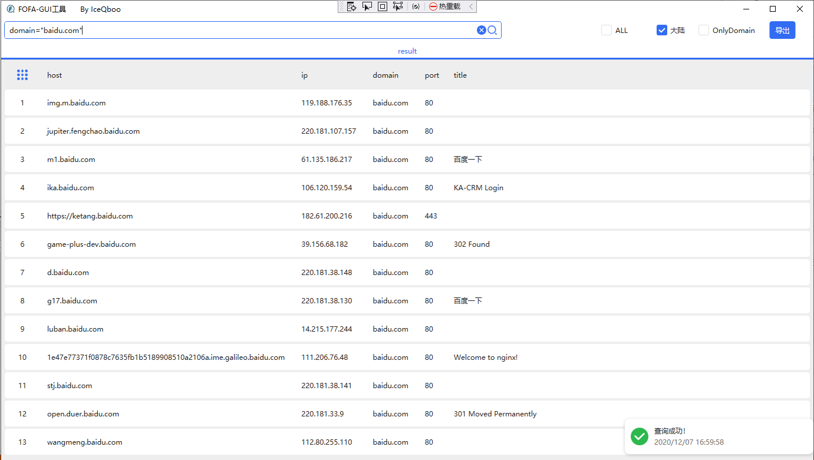

# fofahelper
一个fofa搜索辅助小工具，**在原版基础上增加导出等功能**

## 配置文件 
修改fofa.exe同目录下fofa.ini配置文件，格式如下：
```
{
    "email": "xxx@mail.com",
    "key": "xxxxxxxxxxxxxxxxxxxxxxxx"
}
```
## 效果 

## 感谢
> https://github.com/x51/fofahelper
>